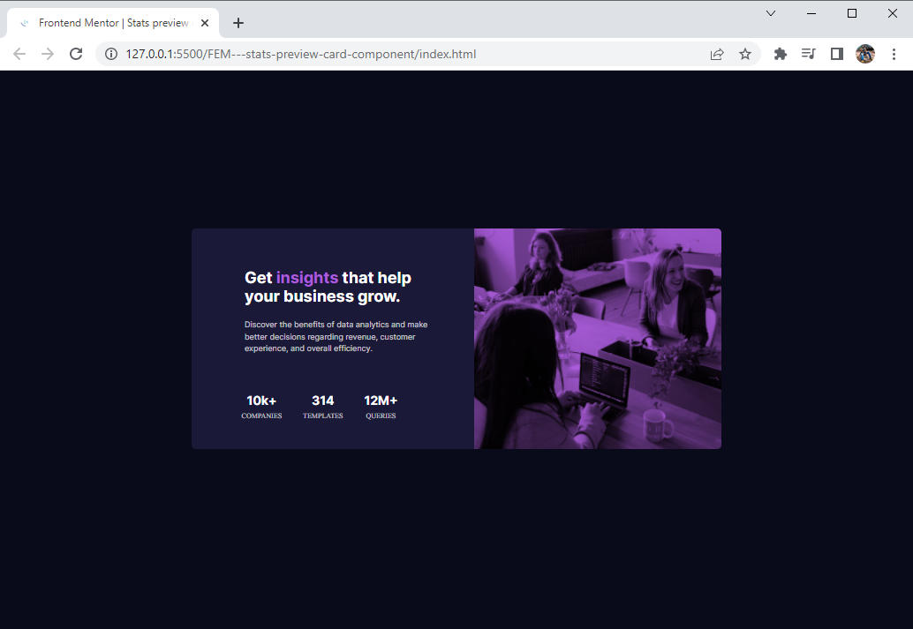
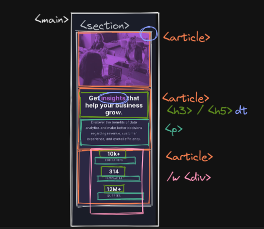

# Frontend Mentor - Stats preview card component solution

This is a solution to the [Stats preview card component challenge on Frontend Mentor](https://www.frontendmentor.io/challenges/stats-preview-card-component-8JqbgoU62). Frontend Mentor challenges help you improve your coding skills by building realistic projects. 

## Table of contents

- [Overview](#overview)
  - [The challenge](#the-challenge)
  - [Outcome](#outcome)
- [My process](#my-process)
  - [Approach](#approach)
  - [Built with](#built-with)
- [Author](#author)
- [Acknowledgments](#acknowledgments)

## Overview

### The challenge

### Outcome

- MOBILE Version:

- (NEW) Middle device Version:

- DESKTOP Version:

## My process

### Approach

### Built with

- Semantic HTML5 markup
- CSS custom properties
- Flexbox
- CSS Grid
- Mobile-first workflow
- Mid-Device version

## Author

- Website - [Kimue](https://dratinixgithub.github.io/FEM---stats-preview-card-component)
- Frontend Mentor - [@dratinixgithub](https://www.frontendmentor.io/profile/dratinixgithub)

## Acknowledgments

